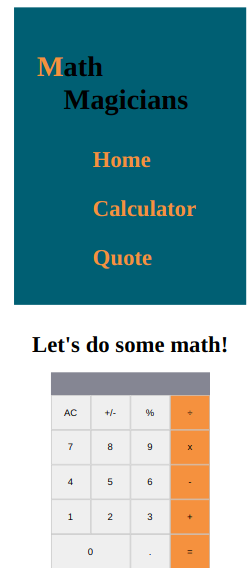
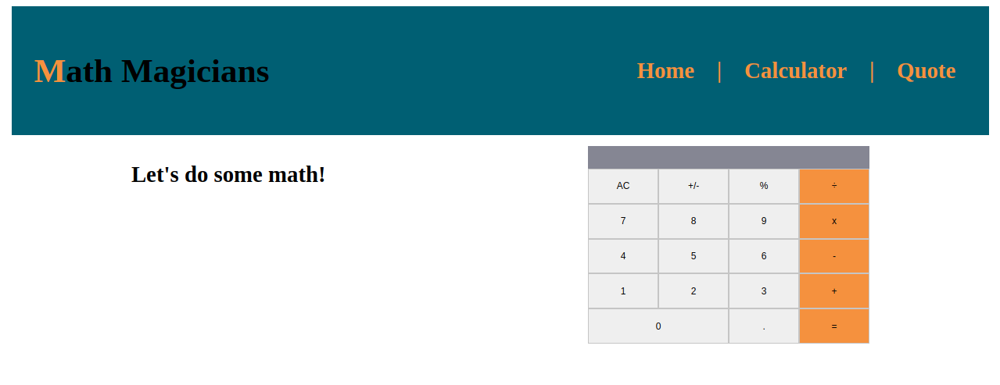

# Math Magicians

> Single Page Application (SPA) allows you to use a built-in calculator, read some famous quotes related to math.

This application is built using React.

## Mobile 📱

## Desktop 💻

## Live Demo 
https://mike-math-magicians.herokuapp.com/

## Built With

- React
- VSCode

### Prerequisites

- Web browser
- Visual Studio Code

## Setup

To get a local copy up and running follow these simple example steps.

Open terminal
Clone this project by command git clone https://github.com/mike2611/math-magicians.git

- Download/Clone the repository files
- Open terminal and move to the root folder
- Run `npm install` to get ahold of all dependencies
- Run `npm start`

## Authors

**👤 Miguel Angel Puentes**

- GitHub: [@mike2611](https://github.com/mike2611)
- Twitter: [@MiguelP2611](https://twitter.com/MiguelP2611)
- LinkedIn: [LinkedIn](https://linkedin.com/in/miguel-puentes-mata-90a562139/)

## Testing Co-Author: Jose Abel Ramirez Frontany\*\*

- GitHub: [Jose Abel Ramirez Frontany](https://github.com/jose-Abel)
- Linkedin: [Jose Abel Ramirez Frontany](https://www.linkedin.com/in/jose-abel-ramirez-frontany-7674a842/)

## 🤝 Contributing

Contributions, issues, and feature requests are welcome!

Feel free to check the [issues page](../../issues/).

## Show your support

Give a ⭐️ if you like this project!

## Acknowledgments

- [Microverse](https://www.microverse.org/)
